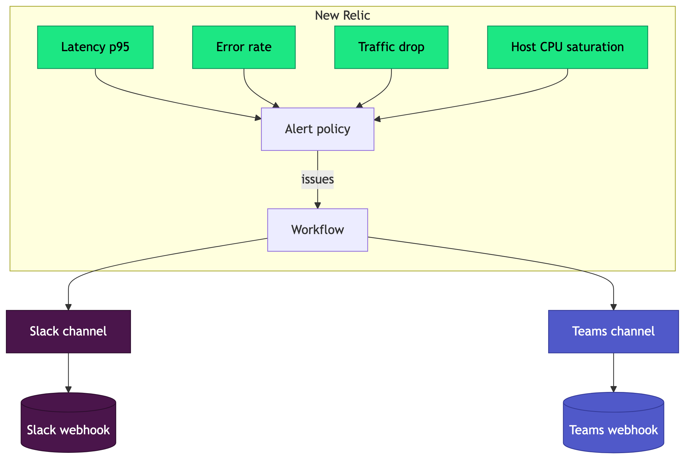

# Golden-Signal Alerting as Code: From NRQL to Slack and Teams with Terraform

*Stop clicking alerts together in a UI. Here is how to define the four signals that actually matter, route them to your team, and keep the whole thing in version control.*



> Companion code: [projects/newrelic-golden-signals](../projects/newrelic-golden-signals) · Published on [Medium (@anandnaveen)](https://medium.com/@anandnaveen)

---

If you have ever inherited a monitoring setup, you know the two failure modes. Either there are almost no alerts, so problems are found by angry users, or there are hundreds, so nobody reads them and the one that mattered scrolls past at 3am.

The fix is not more alerts. It is the right alerts, defined as code so they are reviewed, versioned, and reproducible. This post walks through doing exactly that on New Relic with Terraform: the four golden signals as alert conditions, grouped in a policy, routed to both Slack and Microsoft Teams through a workflow.

All the code is in a public repo you can clone and adapt: [github.com/nanand1806/devops-sre-observability](https://github.com/nanand1806/devops-sre-observability/tree/main/projects/newrelic-golden-signals).

## What to alert on: the four golden signals

Google's SRE practice distills service health into four signals. Get these right and you cover most real problems without drowning in noise.

- **Latency**: how long requests take. Alert on a high percentile like p95, not the average, because the average hides the slow tail your users actually feel.
- **Traffic**: how much demand the service is getting. A sudden drop is often the first sign of an outage upstream of you.
- **Errors**: the rate of failing requests, measured as a percentage so it scales with traffic.
- **Saturation**: how full your most constrained resource is, often CPU or memory. Saturation is your early warning because it predicts the other three getting worse.

If you only have time to set up four alerts, set up these.

## How New Relic alerting fits together

Before the code, the mental model. New Relic has a few moving parts, and once you see how they connect the Terraform reads easily.

- **Condition**: the rule itself, written as a NRQL query plus a threshold.
- **Policy**: a group of conditions. Notifications attach to the policy.
- **Issue**: when a condition breaches, New Relic opens an issue on the policy.
- **Destination**: where a notification goes, such as a Slack or Teams webhook.
- **Channel**: the formatted message for a destination.
- **Workflow**: the wiring that says "issues from this policy go to these channels."

The flow is: condition breaches, an issue opens on the policy, the workflow matches it, the channel formats it, the destination delivers it.

## Step 1: the provider and the policy

```hcl
terraform {
  required_providers {
    newrelic = {
      source  = "newrelic/newrelic"
      version = "~> 3.0"
    }
  }
}

provider "newrelic" {
  account_id = var.account_id
  api_key    = var.api_key
  region     = var.region
}

resource "newrelic_alert_policy" "golden" {
  name                = var.policy_name
  incident_preference = "PER_CONDITION_AND_TARGET"
}
```

`PER_CONDITION_AND_TARGET` opens a separate issue per condition per entity, so a latency problem and an error problem are tracked apart instead of collapsing into one noisy issue.

## Step 2: the four signals, defined once

Rather than copy-paste four nearly identical condition blocks, define the signals in a map and create them with `for_each`. This keeps the alerting DRY and makes it obvious at a glance what is being watched.

```hcl
locals {
  golden_signals = {
    latency = {
      name      = "Golden Signal - Latency (p95)"
      query     = "SELECT percentile(duration, 95) FROM Transaction WHERE appName = '${var.app_name}'"
      operator  = "above"
      threshold = var.latency_threshold_seconds
    }
    errors = {
      name      = "Golden Signal - Error rate"
      query     = "SELECT percentage(count(*), WHERE error IS true) FROM Transaction WHERE appName = '${var.app_name}'"
      operator  = "above"
      threshold = var.error_rate_threshold_percent
    }
    traffic = {
      name      = "Golden Signal - Traffic (throughput drop)"
      query     = "SELECT rate(count(*), 1 minute) FROM Transaction WHERE appName = '${var.app_name}'"
      operator  = "below"
      threshold = var.min_throughput_rpm
    }
    saturation = {
      name      = "Golden Signal - Saturation (host CPU)"
      query     = "SELECT average(cpuPercent) FROM SystemSample"
      operator  = "above"
      threshold = var.cpu_saturation_threshold_percent
    }
  }
}

resource "newrelic_nrql_alert_condition" "golden" {
  for_each = local.golden_signals

  policy_id   = newrelic_alert_policy.golden.id
  type        = "static"
  name        = each.value.name
  description = "Golden signal alert. Runbook: ${var.runbook_url}"
  enabled     = true

  aggregation_window = 60
  aggregation_method = "event_flow"
  aggregation_delay  = 120

  nrql {
    query = each.value.query
  }

  critical {
    operator              = each.value.operator
    threshold             = each.value.threshold
    threshold_duration    = 300
    threshold_occurrences = "all"
  }
}
```

A note on NRQL if it is new to you: it looks like SQL and returns a number New Relic evaluates against your threshold. `SELECT percentile(duration, 95) FROM Transaction WHERE appName = 'my-service'` means "the 95th-percentile request duration for my-service," computed continuously over rolling 60-second windows.

The `threshold_duration` of 300 with `threshold_occurrences = "all"` means the condition must stay breached for a full 5 minutes before it alerts. That single setting removes most flapping.

## Step 3: route issues to Slack and Teams

Destinations and channels come in pairs. The destination holds the webhook URL; the channel holds the message template. Here is Slack:

```hcl
resource "newrelic_notification_destination" "slack" {
  account_id = var.account_id
  name       = "Slack - golden signals"
  type       = "WEBHOOK"

  property {
    key   = "url"
    value = var.slack_webhook_url
  }
}

resource "newrelic_notification_channel" "slack" {
  account_id     = var.account_id
  name           = "Slack channel - golden signals"
  type           = "WEBHOOK"
  destination_id = newrelic_notification_destination.slack.id
  product        = "IINT"

  property {
    key = "payload"
    value = jsonencode({
      text = ":rotating_light: *{{ issueTitle }}*\nPriority: {{ priority }} | State: {{ state }}\n<{{ issuePageUrl }}|Open issue in New Relic>"
    })
    label = "Payload Template"
  }
}
```

Teams is the same shape, with a MessageCard payload instead of Slack's blocks. The `{{ issueTitle }}`, `{{ priority }}`, and `{{ issuePageUrl }}` tokens are New Relic's template variables, filled in at delivery time.

This matters more than it looks. An alert that just says "issue opened" makes the on-call person go digging. An alert that carries the title, priority, state, and a direct link turns a 3am page into "click here." Add the runbook link from the condition description and you have turned an alert into a runbook entry point.

## Step 4: the workflow ties it together

```hcl
resource "newrelic_workflow" "golden" {
  account_id            = var.account_id
  name                  = "Golden signals to Slack and Teams"
  muting_rules_handling = "NOTIFY_ALL_ISSUES"

  issues_filter {
    name = "golden-signals-policy"
    type = "FILTER"

    predicate {
      attribute = "labels.policyIds"
      operator  = "EXACTLY_MATCHES"
      values    = [newrelic_alert_policy.golden.id]
    }
  }

  destination {
    channel_id = newrelic_notification_channel.slack.id
  }

  destination {
    channel_id = newrelic_notification_channel.teams.id
  }
}
```

The filter matches every issue raised on our policy and fans it out to both channels.

## Keep the secrets out of the repo

The API key and webhook URLs are sensitive variables with no defaults. Pass them through the environment, never a committed file:

```bash
export TF_VAR_api_key="NRAK-your-user-api-key"
export TF_VAR_slack_webhook_url="https://hooks.slack.com/services/your/webhook"
export TF_VAR_teams_webhook_url="https://yourtenant.webhook.office.com/your/webhook"

terraform init
terraform apply
```

The repo enforces this with gitleaks in CI so a secret cannot be committed by accident.

## Testing the pipeline

You do not have to wait for a real incident. Temporarily set a threshold that will trip, for example `latency_threshold_seconds = 0`, apply, confirm the message lands in both Slack and Teams, then revert. It is the fastest way to prove the whole chain works end to end.

## Going deeper

Once the basics are in place:

- **Baseline thresholds**: traffic and latency often suit `type = "baseline"`, which alerts on deviation from a learned normal rather than a fixed line. Good for signals with daily or weekly rhythms.
- **Warning thresholds**: add a `warning` block alongside `critical` for an earlier, lower-severity heads-up.
- **Muting rules**: silence known maintenance windows so deploys do not page anyone.
- **Per-signal routing**: split into multiple workflows to send saturation to one channel and errors to another.
- **SLOs**: layer service level objectives and burn-rate alerts on top of the golden signals for truly user-focused alerting.

## Why do this as code at all

Clicking alerts together in a UI works until you have more than a handful of services. Then you have no record of who changed what, no review before a threshold goes live, no easy way to copy a known-good setup to a new service, and no recovery if someone deletes a policy. As code, your alerting is reviewed in pull requests, versioned, and reproducible. The same reasons you keep infrastructure in Terraform apply to the alerts watching it.

The full, runnable project is here, along with a beginner-friendly concept doc: [projects/newrelic-golden-signals](../projects/newrelic-golden-signals).

---

*If you found this useful, follow me on [Medium (@anandnaveen)](https://medium.com/@anandnaveen) for more practical DevOps and cloud writing. I publish reference projects on AWS, Azure, Terraform, and SRE that you can clone and use.*
