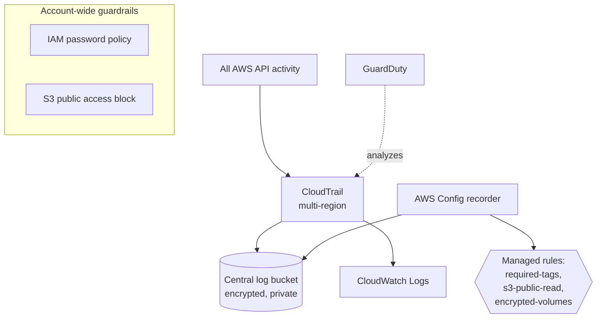

# AWS landing zone baseline

The account-level guardrails you put in place *before* workloads arrive: audit logging, configuration compliance, threat detection, and account-wide safety nets. This is the AWS counterpart to the [`azure-landing-zone`](../azure-landing-zone) project.

This is a single-account baseline you can deploy with admin on one account. A full multi-account landing zone (AWS Organizations, Control Tower, Service Control Policies) needs the management account and is covered under "going deeper".

## What gets created

- **CloudTrail**: multi-region, log-file-validated trail recording every API call, delivered to S3 and mirrored to CloudWatch Logs.
- **AWS Config**: a configuration recorder plus three managed rules (required tags, no public-read S3, encrypted EBS volumes).
- **GuardDuty**: managed threat detection turned on.
- **IAM password policy**: strong password requirements for the account.
- **Account-wide S3 public access block**: blocks public buckets across the whole account.
- **Central log bucket**: encrypted, versioned, TLS-enforced, private, shared by CloudTrail and Config.

## Architecture



## Prerequisites

- Terraform >= 1.5
- AWS credentials with administrative permissions on the target account (this provisions account-level services)
- Awareness that some resources are **account-wide** (see the warning below)

## Account-wide effects (read this first)

Two resources here change account-level settings, not just their own resources:

- `aws_s3_account_public_access_block` blocks public access for **every** bucket in the account.
- `aws_iam_account_password_policy` sets the password policy for **all** IAM users.

Deploy this in a sandbox or personal account first, not a shared account where other people rely on different settings.

## Usage

```bash
cp terraform.tfvars.example terraform.tfvars   # defaults are fine
terraform init
terraform plan
terraform apply
```

After apply, generate some activity and watch it land:

```bash
aws cloudtrail get-trail-status --name "$(terraform output -raw cloudtrail_name)"
aws configservice describe-config-rules --query 'ConfigRules[].ConfigRuleName'
```

Config takes a few minutes to evaluate rules for the first time.

## Cost note

- **CloudTrail**: the first management-event trail is free; storage in S3 is cents.
- **Config**: bills per configuration item recorded and per rule evaluation. On a small account this is low but not zero, the main thing to turn off when done.
- **GuardDuty**: 30-day free trial, then usage-based.

Tear it down when finished to avoid ongoing Config charges.

## Teardown

```bash
terraform destroy
```

The log bucket has `force_destroy = true` so destroy removes it even with logs inside. In production you would keep the bucket and its history.

## Going deeper

- **Multi-account**: real landing zones span an Organization. Use AWS Control Tower to set up the management, log-archive, and audit accounts, then govern with Service Control Policies.
- **Region restriction**: an SCP denying all regions except your approved ones is the AWS equivalent of the Azure "allowed locations" policy. SCPs require Organizations.
- **Conformance packs**: deploy a whole set of Config rules as one pack (for example the operational-best-practices or CIS pack).
- **Security Hub**: aggregate GuardDuty, Config, and other findings into one dashboard with a compliance score.
- **Alerting**: turn CloudTrail CloudWatch Logs into metric filters and alarms (for example, alert on root account usage or IAM policy changes).
