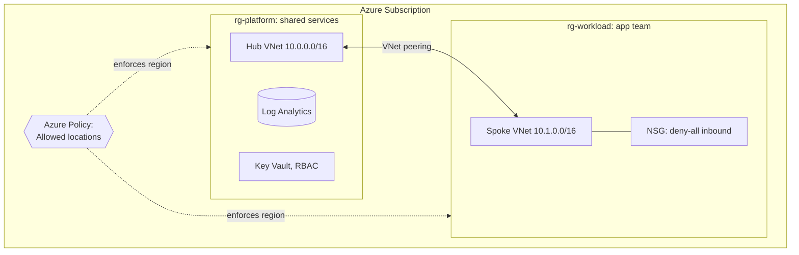

# Azure landing zone baseline

A starter landing zone on Azure: the shared foundation you put down *before* teams start deploying workloads. It sets up segregated resource groups, a hub-and-spoke network, a governance policy, central logging, and a Key Vault, all as code.

This is a deliberately approachable baseline, not a full enterprise-scale landing zone (which spans management groups and multiple subscriptions and needs tenant-level permissions). It teaches the core ideas on a single subscription you control.

## What a landing zone is

Before applications arrive, you decide the rules of the environment: how resources are grouped, how networks connect, what regions are allowed, where logs go, how secrets are stored. A landing zone is that foundation, codified so every environment starts consistent and governed instead of hand-built and drifting.

## Architecture



## What gets created

Two resource groups (platform and workload), a hub VNet and a spoke VNet with bidirectional peering, a subnet and deny-all NSG on the spoke, a central Log Analytics workspace, an RBAC-enabled Key Vault, and a subscription-scoped "Allowed locations" policy assignment.

## Prerequisites

- Terraform >= 1.5
- Azure CLI logged in: `az login`
- Permission on the target subscription. Creating the resources needs **Contributor**; assigning the policy needs **Owner** or **Resource Policy Contributor**.
- Your subscription ID: `az account show --query id -o tsv`

## Usage

```bash
cp terraform.tfvars.example terraform.tfvars
# edit terraform.tfvars: set subscription_id to your subscription
terraform init
terraform plan
terraform apply
```

Authentication comes from your `az login` session. You can also export `ARM_SUBSCRIPTION_ID` instead of setting it in tfvars.

## Verifying the governance policy

After apply, try creating a resource group in a region not in `allowed_locations`:

```bash
az group create --name rg-policy-test --location westeurope
```

Azure denies it because the policy assignment blocks disallowed regions. That is governance enforced automatically, not by a wiki page people forget.

## Cost note

Most of this is free or near-free at rest: resource groups, VNets, peering, NSGs, policy, and an empty Key Vault cost essentially nothing. Log Analytics bills on data ingested, so an idle workspace is negligible. Tear it down when done anyway.

## Teardown

```bash
terraform destroy
```

## Going deeper

- **Management groups**: a real landing zone applies policy at the management-group level so it covers many subscriptions at once. That needs tenant root permissions.
- **Diagnostic settings**: wire each resource's diagnostics to the Log Analytics workspace so logs actually flow.
- **Azure Firewall in the hub**: route spoke egress through a firewall in the hub for centralized inspection.
- **More policies**: require tags, enforce HTTPS, restrict SKUs. Group them into a policy initiative (set).
- **Private DNS + private endpoints**: resolve PaaS services privately from the spoke, the Azure equivalent of the private-subnet pattern in the ECS project.
