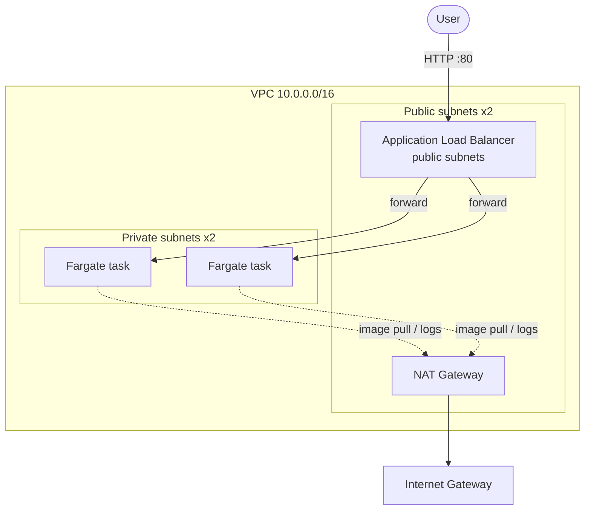

# ECS Fargate service with Terraform

A containerized web service running on AWS ECS Fargate behind an Application Load Balancer. Tasks run in private subnets and reach the internet through a NAT gateway. This is the pattern most teams reach for when they want containers without managing servers.

## Architecture



- **ALB** sits in public subnets and is the only thing exposed to the internet.
- **Fargate tasks** run in private subnets with no public IP. The service security group only accepts traffic from the ALB security group.
- **NAT gateway** gives tasks outbound access to pull the container image and ship logs.
- **CloudWatch Logs** and **Container Insights** are enabled for observability.

## What gets created

VPC, 2 public + 2 private subnets across 2 AZs, internet gateway, NAT gateway, route tables, two security groups, ECS cluster, task definition, ECS service, ALB with listener and target group, two IAM roles, and a CloudWatch log group.

## Prerequisites

- Terraform >= 1.5
- AWS credentials configured (for example `aws configure` or environment variables) with permissions to create the resources above
- An AWS account you are comfortable spending a small amount in

## Usage

```bash
cp terraform.tfvars.example terraform.tfvars   # optional, defaults work as-is
terraform init
terraform plan
terraform apply
```

When apply finishes, open the `alb_dns_name` output in a browser. You should see the default nginx page served by a Fargate task.

```bash
terraform output alb_dns_name
```

## Cost note

This stack provisions billable resources. The main driver is the **NAT gateway** (hourly + data processing) and the **ALB** (hourly + LCU). Running it for an hour to learn costs cents; leaving it running for weeks does not. Tear it down when you are done.

To cut cost for pure experimentation, you can place tasks in public subnets with `assign_public_ip = true` and drop the NAT gateway. That is shown here the production-correct way instead, with tasks isolated in private subnets.

## Teardown

```bash
terraform destroy
```

## Notes

- All names and values here are generic placeholders. Set `project_name` and `environment` to suit your own account.
- For production: run a NAT gateway per AZ, add HTTPS (ACM certificate + 443 listener with HTTP redirect), enable deletion protection on the ALB, and store state remotely (see the `terraform-remote-state` project).
