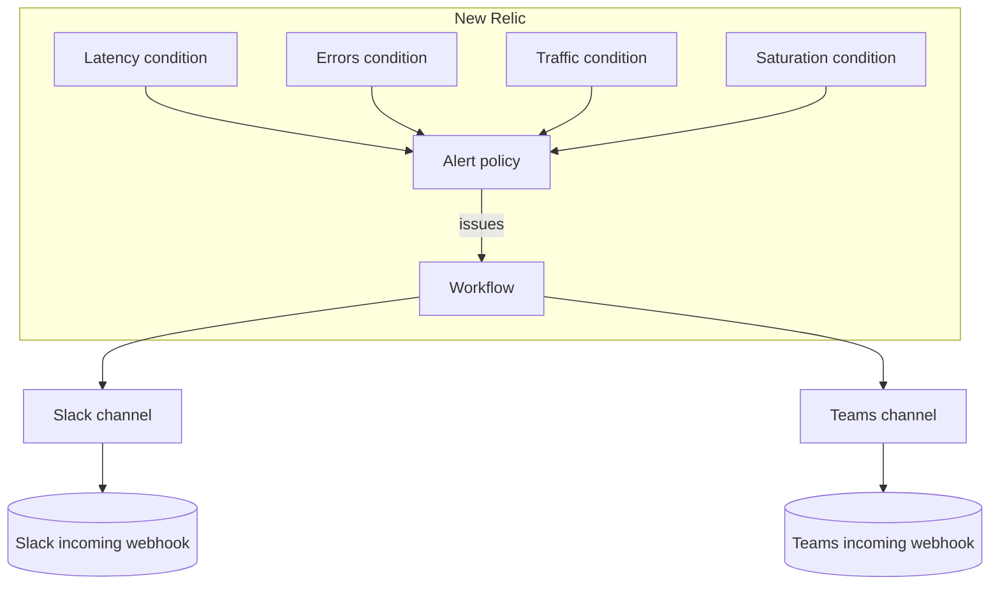

# Golden-signal alerting on New Relic, as code

The four golden signals (latency, traffic, errors, saturation) as New Relic NRQL alert conditions, grouped in one policy, with a workflow that delivers every issue to **Slack and Microsoft Teams**. All defined in Terraform so your alerting is version-controlled and reviewable instead of clicked together in a UI.

## Why golden signals

You cannot alert on everything, and you should not try. Google's SRE practice distills service health into four signals that catch most real problems:

- **Latency**: how long requests take (here, p95 response time).
- **Traffic**: how much demand the service is getting (throughput). Alerting on a sudden drop catches outages upstream.
- **Errors**: the rate of failing requests.
- **Saturation**: how full the resources are (here, host CPU).

Get these four right and you have meaningful coverage without alert fatigue.

## Architecture



A condition breaching its threshold opens an **issue** on the policy. The workflow matches issues from this policy and routes them to both notification channels, each with its own message format.

## What gets created

One alert policy, four NRQL conditions (via `for_each`), two notification destinations (Slack, Teams), two channels with formatted payload templates, and one workflow connecting the policy to both channels.

## Prerequisites

- Terraform >= 1.5
- A New Relic account ID and a **User API key** (`NRAK-...`)
- An incoming webhook URL for Slack and one for Teams
- Your service reporting to New Relic APM as `app_name` (the saturation signal also needs the infrastructure agent for `SystemSample`)

## Usage

Pass secrets as environment variables, never in a committed file:

```bash
export TF_VAR_api_key="NRAK-REPLACE_WITH_YOUR_USER_API_KEY"
export TF_VAR_slack_webhook_url="https://hooks.slack.com/services/REPLACE"
export TF_VAR_teams_webhook_url="https://yourtenant.webhook.office.com/REPLACE"

cp terraform.tfvars.example terraform.tfvars
# edit terraform.tfvars: set account_id and app_name (leave the secret lines out)
terraform init
terraform plan
terraform apply
```

## Testing the pipeline

The cleanest way to test delivery without waiting for a real incident is to temporarily set a threshold that will trip (for example `latency_threshold_seconds = 0`), apply, confirm the message arrives in Slack and Teams, then revert. New Relic also has an "acknowledge / resolve" flow you can exercise from the issue.

## Customizing the messages

The Slack and Teams message formats are the `payload` templates in `notifications.tf`. They use New Relic's handlebars variables (`{{ issueTitle }}`, `{{ priority }}`, `{{ state }}`, `{{ issuePageUrl }}`). Edit those templates to add fields, links, or severity colors.

## Teardown

```bash
terraform destroy
```

## Going deeper

- **Runbook links**: each condition's description carries a `runbook_url`. Point it at the exact page for that signal so responders get context, not just an alert.
- **Baseline conditions**: traffic and latency often suit `type = "baseline"`, which alerts on deviation from a learned normal instead of a fixed number.
- **Warning thresholds**: add a `warning {}` block alongside `critical {}` for early, lower-severity heads-up.
- **Muting rules**: silence known maintenance windows so deploys do not page anyone.
- **Per-signal routing**: split into multiple workflows to send saturation to one channel and errors to another.
- **SLOs**: layer service level objectives and burn-rate alerts on top of the golden signals for user-focused alerting.
