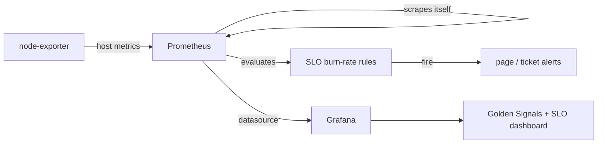

# Observability starter: Prometheus, Grafana, and SLO burn-rate alerts

A runnable, vendor-neutral observability stack you can stand up in one command. It shows the four golden signals on a Grafana dashboard and implements proper **multi-window, multi-burn-rate SLO alerting** in Prometheus, the approach from the Google SRE Workbook.

Everything runs locally with Docker. No cloud account needed.

## What you get

- **Prometheus** scraping metrics and evaluating SLO rules.
- **Grafana** with a pre-provisioned dashboard (no manual import) showing latency, traffic, errors, and saturation.
- **node-exporter** for host metrics (the saturation signal).
- **SLO alert rules** for a 99.9% availability target, with fast/medium/slow burn-rate alerts.

The example SLI is built on Prometheus's own HTTP metrics, so the dashboard and alerts populate with real data immediately, with no extra app to deploy. In your environment you point the same rules at your service's request metrics.

## Architecture



## Run it

```bash
docker compose up -d
```

Then open:

- Grafana: http://localhost:3000 (login `admin` / `admin`, the dashboard is under Dashboards)
- Prometheus: http://localhost:9090 (check Status > Rules to see the SLO rules, and Alerts to see their state)

Tear down with:

```bash
docker compose down -v
```

## The SLO alerting, in short

The rules implement a 99.9% availability SLO (0.1% error budget). "Burn rate" is how fast you are spending that budget: burn rate 1 would exhaust the monthly budget in exactly a month, burn rate 14.4 exhausts 2% of it in an hour.

Each alert pairs a long window with a short window:

| Alert | Long / short window | Burn rate | Action |
|---|---|---|---|
| Fast | 1h / 5m | 14.4x | Page |
| Medium | 6h / 30m | 6x | Page |
| Slow | 1d / 2h | 3x | Ticket |
| Very slow | 3d / 6h | 1x | Ticket |

The long window confirms the problem is real and sustained; the short window confirms it is still happening now, so the alert fires quickly and also stops quickly once resolved. This is what makes burn-rate alerting far less noisy than a flat "error rate above 1%" threshold.

## Make it yours

Edit `prometheus/rules/slo-burn-rate.yml` and replace `prometheus_http_requests_total` with your own service's request counter (and the `code=~"5.."` selector with however you define a failed request). Change `0.001` if your SLO is not 99.9%.

## Going deeper

- **Alertmanager**: add it to route `severity: page` to PagerDuty and `severity: ticket` to Slack or Teams (see the `newrelic-golden-signals` project for the routing idea on a managed platform).
- **Latency SLOs**: define a second SLO on the fraction of requests served under a target latency, not just on errors.
- **Recording rules for the dashboard**: precompute heavy queries as recording rules so dashboards stay fast.
- **Long-term storage**: Prometheus keeps 7 days here; add Thanos or Mimir for long retention and global view.
- **More exporters**: scrape your databases, queues, and apps with their exporters to extend coverage.
