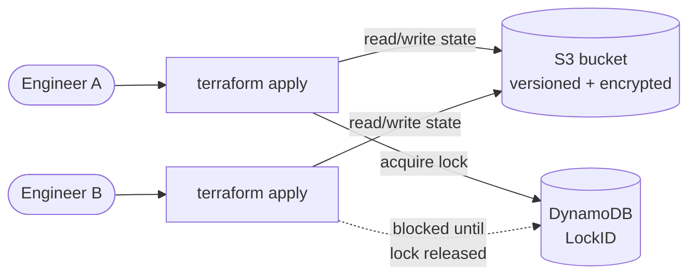

# Terraform remote state with S3 and DynamoDB

The first thing to fix on any team using Terraform: get state off your laptop. This project creates the standard remote backend, an **S3 bucket** for the state file and a **DynamoDB table** for locking, then shows a second project using it.

## Why this exists

Terraform records what it manages in a state file. By default that file sits on your local disk. That breaks down fast:

- A teammate cannot see or use your state, so you drift apart.
- Two applies at once can corrupt state.
- A lost laptop loses the state and any secrets inside it.

Remote state solves all three: one shared copy in S3, a lock in DynamoDB so only one apply runs at a time, versioning and encryption for safety.

## Architecture



While Engineer A holds the lock, Engineer B's apply waits instead of corrupting shared state.

## The chicken-and-egg problem

You cannot store the state bucket's own state inside a bucket that does not exist yet. So this project has two parts:

1. **`bootstrap/`** creates the bucket and lock table using **local state**. You run this once.
2. **`example-consumer/`** is a normal project that **uses** the remote backend.

## Step 1: create the backend

```bash
cd bootstrap
cp terraform.tfvars.example terraform.tfvars
# edit terraform.tfvars and set a globally unique state_bucket_name
terraform init
terraform apply
terraform output backend_config   # prints a ready-to-paste backend block
```

## Step 2: use it from another project

```bash
cd ../example-consumer
cp backend.tf.example backend.tf
# edit backend.tf: set bucket to the name you chose above
terraform init -migrate-state
terraform apply
```

`terraform init -migrate-state` moves the local state into S3. From now on, every plan and apply reads state from S3 and takes a DynamoDB lock first. Run `terraform apply` from a second machine and you will see the same state.

## Verifying the lock works

Start an apply and, while it runs, start another in a second terminal. The second one prints `Acquiring state lock` and waits. That is the DynamoDB lock doing its job.

## Cost note

S3 storage for a state file is fractions of a cent. DynamoDB is pay-per-request, so you pay only when locks are taken. This is one of the cheapest things you will run in AWS. Still, tear it down if it is only for learning.

## Teardown

```bash
# Destroy the consumer first (it depends on the backend)
cd example-consumer && terraform destroy

# The bucket must be emptied before it can be deleted (versioning keeps old objects).
# Then destroy the backend:
cd ../bootstrap && terraform destroy
```

If destroy fails on a non-empty bucket, empty it in the console or with `aws s3 rm s3://YOUR_BUCKET --recursive` (this deletes your state, only do it when tearing everything down).

## Going deeper

- **Native S3 locking**: Terraform 1.10+ can lock with an S3 object (`use_lockfile = true`) and skip DynamoDB entirely. DynamoDB is shown here because it is what most existing setups use and is broadly compatible.
- **One backend, many keys**: give each project a unique `key` so they share the bucket without colliding.
- **Per-environment isolation**: separate state by key prefix (`dev/`, `staging/`, `prod/`) or by separate buckets per account.
- **KMS encryption**: swap SSE-S3 for a customer-managed KMS key when compliance requires it.
- **Lock down access**: a bucket policy enforcing TLS-only and restricting who can read state is the next hardening step.
